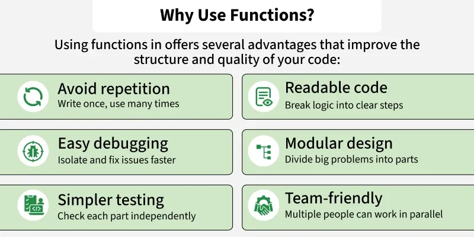

Functions:-
A function is a reusable block of code that performs a spesific task.
It divides program into smaller logical units,improves readability, and makes code easier to maintain.
A function can accept parameters,execute statements,and optionally return a value.
C++ suports adv features like function overloading,default arguments,and inline functions unlike C.
Syntax in C++:- In function.cpp.

Importance of function:-
    1.Avoid repetations
    2.Readable code
    3.Easy debugging
    4.Modular design
    5.Simpler testing
    6.Team friendly

Function Declaration:-
it introduces the function to the compiler by specifying its retun type,name,and parameters without the body.
    like:-  //Declaration
            int add(int,int);

Function Defination:-
it contains the actual code that specifies what the function does when called.
    like:-  //Defination
            int add(int a,int b){
                return a+b;
            }

A function must be declared before it is used so that compiler knows the details.

Function call:-
A function is called using its name followed by the parentheses,passing the required arguments,if any,which executes the function code inside the program.
    eg:- in function.cpp

Parameters and Arguments
A function can accepts input values called arguments,
which is passed during the function call. and recieved through typed parameters defined inside the function parantheses.

A function can take as many arguments as specified un the function defination.

Parameters have two types :-
    1.Formal Parameter:- Also known as Arguments are declared in Function defination.
    2.Actual Parameter:- Actual values passed while calling.

Types of Function in C++
    1.Based on the origin:-
        1.Library Functions:- built in functions provided by C++ standard libraries, such as sqrt(),abs(),getline(), Can be used by including at the header.
        2.User Defined Functions:- Functions created by the programmer to perform specific task.

    2.Based on Input and Return Type:-
        1.No parameters,no return value
        2.parameters,no return value
        3.No parameters,return value
        4.Parameters,return value

A void function is a function that performs an action but does not return a value back to the program that called it.
Day 3 — 2h 44m session time; ~2–2.5h effective study